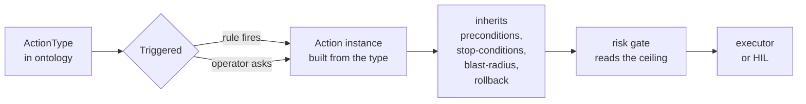

# Ontology-driven automation

FDAI does not hard-code what it is allowed to do. Every change it can make is
described once as a typed **`ActionType`** in a catalog-as-code **ontology**.
When a rule fires or an operator asks, that type is *instantiated* into a
concrete action that inherits the type's safety contract, flows through one
shared pipeline, and lands as an audited outcome. Adding a new capability is one
YAML file - there is no new branch in the engine and no new executor.

This page explains the ontology, how an entry becomes a running action, and the
business pipeline that carries it from signal to audit.

## What the ontology is

The ontology is a versioned catalog of `ActionType` entries. Each entry is the
authoritative definition of one thing FDAI can do - `remediate.disable-public-access`,
`ops.restart-service`, `remediate.right-size`, `governance.promote-action-type`,
and so on. Entries are grouped into three categories:

- **`remediation`** - rule-fired, config-drift-style changes.
- **`ops`** - operator-requested runtime actions (restart, scale, flush).
- **`governance`** - catalog, exemption, and promotion changes.

Because the ontology is data, not code, a fork adds or overrides entries through
config without touching the core engine.

## Anatomy of an ActionType

An `ActionType` is not just a name - it declares its own guardrails. The safety
invariants FDAI requires (stop-condition, rollback path, blast-radius limit,
audit entry) live on the type, so every instance is born safe. A trimmed
example:

```yaml
name: remediate.disable-public-access
category: remediation
trigger_kind:
  kind: rule_violation
execution_path: pr_native
rollback_contract: state_forward_only
default_mode: shadow          # judge and log only until promoted
promotion_gate:
  min_shadow_days: 14
  min_accuracy: 0.98
  max_policy_escapes: 0
preconditions:
  - kind: resource_property_equals
    property: public_access
    value: enabled
stop_conditions:
  - kind: dependent_resource_degraded
  - kind: time_box_exceeded_seconds
    seconds: 300
blast_radius:
  max_affected_resources: 5
  traversal_depth: 2
ceiling_by_tier:
  t0: { max_autonomy: enforce_hil, min_role: approver }
```

- **`preconditions`** must hold before the action is eligible.
- **`stop_conditions`** abort a running action if the world turns hostile.
- **`blast_radius`** caps how far one action may reach.
- **`rollback_contract`** names how the change is undone.
- **`ceiling_by_tier`** caps autonomy per trust tier - a type can never be
  raised above its declared ceiling by any code path.

## From type to instance

Instantiation is the moment a static ontology entry becomes a live action.



- A **rule violation** at T0/T1/T2 constructs the instance from the matched
  rule plus the finding - the resources, parameters, and scope come from the
  event.
- An **operator request** through the console constructs the instance from the
  chat intent plus the principal and arguments.

Either way, the instance carries the type's contract. The engine does not need
to know whether it is remediating drift or restarting a pod; it runs the same
pipeline with the same guarantees.

## Two triggers, one ontology

The ontology handles both directions of automation with a single `trigger_kind`
axis:

- **`rule_violation`** - the control loop proposes the action (push direction).
- **`operator_request`** - a human requests it via the console (pull direction).
- **`both`** - some actions belong to either surface. `ops.restart-service` can
  be triggered by an operator ("restart this") or by a health-probe rule.

Nothing else in the schema is trigger-specific. The executor, the risk gate, and
the audit contract are identical for both, so an operator-driven action gets the
same safety envelope as a rule-driven one.

## The business pipeline

An instantiated action flows through one pipeline. The ontology supplies the
safety contract at each stage; the agents own the stages (see
[agents-and-self-healing.md](agents-and-self-healing.md)).

```text
event -> event-ingest -> trust-router -> T0 | T1 | (T2 -> quality-gate)
      -> risk-gate    -> auto | HIL | abstain
      -> executor     -> delivery -> audit
```

1. **Ingest** normalizes and correlates the signal into an incident.
2. **Route** scores confidence and picks the cheapest competent tier.
3. **Gate** reads the type's tier ceiling and rules auto, HIL, or deny.
4. **Execute** applies the change only after preconditions pass and the
   per-resource lock is held, honoring stop-conditions and blast-radius.
5. **Deliver** ships the change as a remediation PR or a direct API call.
6. **Audit** appends an immutable entry - including no-ops, rejects, and
   timeouts.

Because the contract is on the type, promoting a capability from shadow to
enforce is a measured, separately reviewed change against the type's
`promotion_gate` - never a surprise (see
[shadow-then-enforce.md](shadow-then-enforce.md)).

## Next steps

| To learn about | Read |
|----------------|------|
| Which agents own each pipeline stage | [agents-and-self-healing.md](agents-and-self-healing.md) |
| How the risk gate reads the tier ceiling | [risk-tiers.md](risk-tiers.md) |
| How a new action earns the right to auto-run | [shadow-then-enforce.md](shadow-then-enforce.md) |
| The full ontology schema and fork seams | [../../roadmap/action-ontology.md](../../roadmap/action-ontology.md) |
