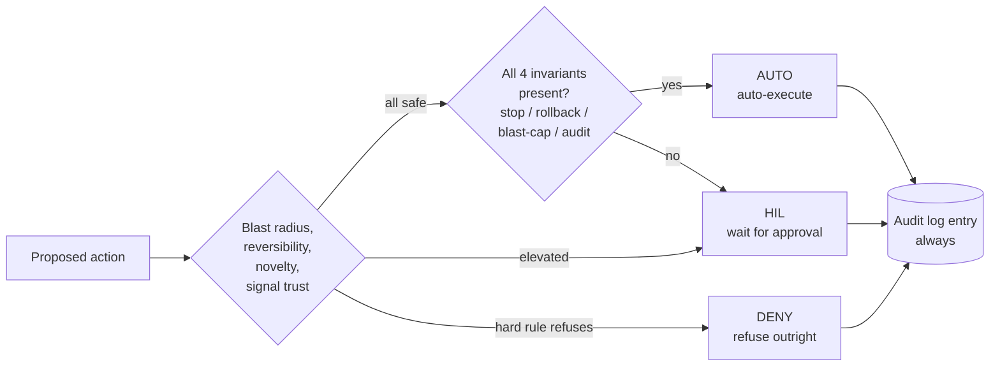

# Risk tiers

Not every decision AIOpsPilot makes should auto-execute. **Risk tiers** are
how the control plane decides whether an action ships without a human, waits
for a human-in-the-loop (HIL) approval, or is refused outright.

## Three verdicts

Every proposed action carries a **risk classification** derived from the
event, the target resource, the environment, and the action's stated
blast-radius. The classification maps to exactly one of:

- **AUTO** — safe enough to execute directly. The audit-log entry still
  records who, what, when, why.
- **HIL** — an operator has to approve. AIOpsPilot pauses execution and
  raises a request through the notification channel (Teams card, PR review,
  email, whatever the deployment configured).
- **DENY** — a hard rule refuses the action outright, regardless of who
  asks. Break-glass exists for the extreme case where a Break-Glass role
  overrides deny; every such use is prominently audited.

## What tips a decision toward HIL

Any of these push a decision up the ladder:

- **Blast radius** — production, multi-region, or shared-tenancy targets
  demand approval more often than isolated dev resources.
- **Reversibility** — actions with no clean rollback path (e.g. some data
  migrations, resource deletions) tend to sit in HIL by default.
- **Novelty** — anything the trust router had to escalate to T2 gets a
  stricter risk gate on the way back down.
- **Signal source trust** — a synthesised anomaly signal weighs less than a
  hardened policy violation.

## What AUTO requires

Every AUTO action ships with all four of these; any missing item downgrades
the action to HIL automatically:

1. **Stop-condition** — a measurable state that halts the change if the
   world reacts badly.
2. **Rollback path** — pre-computed, tested, and referenced from the audit
   entry.
3. **Blast-radius limit** — an explicit cap on scope, batch size, or rate.
4. **Audit-log entry** — append-only, immutable, and complete.

If any of the four is missing, the action is by definition incomplete and
routes to HIL instead. This is not an override — it is a definitional gate.

## Human override is the top-of-stack control

Even when everything is green, an operator with the right role can pause,
downgrade, or reject an AUTO action. Overrides are themselves audited. See
the roadmap's *Human Override* section for the full mechanics.

## Related

- [Deterministic first](../deterministic-first/) — how the router picks
  which tier decides the case in the first place.
- [Shadow, then enforce](../shadow-then-enforce/) — how a new action moves
  from "watch-only" to "auto-execute".
- [Approve a change](../../guides/approve-change/) — the operator's
  everyday view of HIL.
