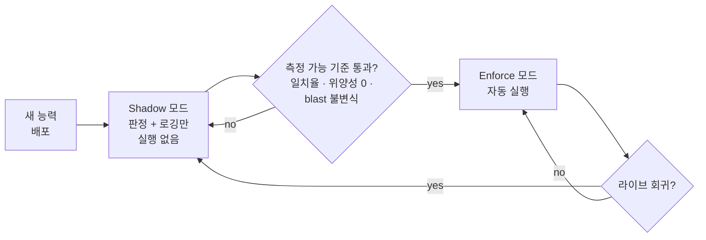

# Shadow, then enforce

AIOpsPilot 의 새 자율 액션은 한꺼번에 켜지지 않습니다. 모든 규칙 · 탐지기 ·
remediation 은 먼저 **shadow 모드** 로 배포됩니다 — 프로덕션에서 내렸을 결정을
동일하게 계산하지만, 그 결정을 기록만 할 뿐 적용하지 않습니다. 기준선 대비 측정된
비교를 통과해야만 실제로 실행할 자격을 얻습니다.

## Shadow 모드가 기록하는 것

새 능력이 shadow 인 동안 모든 이벤트는 자율성이 켜진 것처럼 흐릅니다:

- 전체 trust-routing + risk-gate 결정이 계산됩니다.
- 제안 액션(실행됐을 것)이 저장됩니다.
- *실제* 사람의 해소(운영자가 결국 무엇을 했는지)가 감사 로그에서 수집됩니다.
- 두 결과의 차이가 **shadow 정확도 신호** 입니다.

프로덕션 동작은 변하지 않습니다. 승인은 여전히 사람에게 가고, remediation 은 늘
하던 방식으로 배포됩니다. 새 능력은 관찰하는 것이지 조종하는 것이 아닙니다.

## Shadow → enforce 승격이 요구하는 것

능력은 Phase 0 에서 기록된 기준선 대비 사전 등록된 기준을 shadow 신호가 넘어설
때만 승격됩니다:

- **사람 해소와의 일치율** 이 목표 임계값 위.
- shadow 윈도우 동안 "안전하지 않은 변경을 자동 실행" 클래스에서 **위양성 0** —
  한 번이라도 놓치면 능력은 다시 강등됩니다.
- **Blast-radius 불변식** 유지 — shadow 실행 중 어느 것도 구성된 범위 상한을
  넘지 않았어야 합니다.

승격은 *명시적* 입니다. 별도 PR 이며 자체 게이트로 리뷰됩니다. 능력의 첫 커밋과
번들되지 않습니다.

## 무엇이 강등을 트리거하는가

승격과 강등은 같은 신호를 씁니다. 라이브로 enforce 된 능력이 자체 승격 기준을
놓치기 시작하면 — 정확도가 떨어지거나, 정책 위반 escape 가 기록되거나, 운영자가
override 를 열면 — 자동화가 다시 shadow 로 강등하고 온콜 팀에 알림이 갑니다.
회귀를 고치는 것은 새 승격 사이클이지 hot-patch 가 아닙니다.

## 왜 이게 운영자에게 중요한가

시스템 소비자에게 두 가지 결과:

- **새 자율성은 결코 깜짝 쇼로 오지 않는다.** 액션이 자동 실행을 시작할 즈음이면
  이미 구성된 윈도우 동안 shadow 에서 같은 걸 하는 걸 관찰했고 측정 가능한 기준
  을 통과한 상태입니다.
- **롤백이 저렴하다.** 승격과 강등이 같은 파이프라인을 지나기 때문에 능력을 강제
  실행에서 빼는 것은 영웅적 작업이 아니라 회귀에 대한 기본 반응입니다.

## 관련

- [결정론 우선](../deterministic-first/) — shadow-then-enforce 가 돌아가는 티어.
- [리스크 티어](../risk-tiers/) — shadow 능력이 낳는 액션의 auto vs HIL 의미.
- 엔지니어링 상세: 로드맵의 *Safety Invariants* 절과 phase 문서들의 *Exit gate*
  절.
