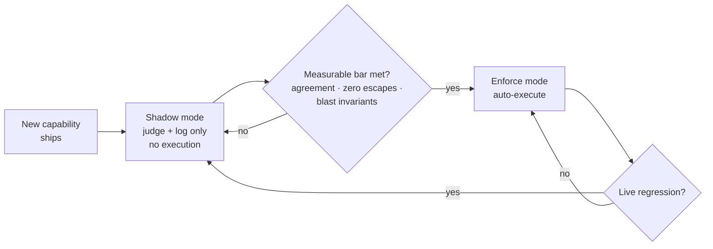

# Shadow, then enforce

New autonomous actions in FDAI never turn on all at once. Each rule,
detector, and remediation ships in **shadow mode** first - it makes the same
decision it *would* make in production, but the decision is recorded, not
applied. Only after a measured comparison against the baseline does the
action earn the right to execute for real.

## What shadow mode records

While a new capability is in shadow, every event flows through it as if
autonomy were on:

- The full trust-routing + risk-gate decision is computed.
- The proposed action (what would have executed) is stored.
- The *actual* human resolution (what operators eventually did) is captured
  from the audit log.
- The delta between the two is the **shadow accuracy signal**.

Nothing about production behaviour changes. Approvals still go to humans,
remediations still ship the way they always did. The new capability is
watching, not steering.

## What promotion from shadow to enforce takes

A capability is promoted only when its shadow signal beats a pre-registered
bar against the baseline recorded in Phase 0:

- **Agreement rate** with human resolutions above the target threshold.
- **Zero false positives** in the "auto-execute an unsafe change" class
  during the shadow window - a single such miss demotes the capability back.
- **Blast-radius invariants** upheld - no shadow run would have exceeded the
  configured scope caps.

Promotion is *explicit*. It is a separate PR, reviewed with its own gate,
never bundled with the capability's first commit.

## What triggers a demotion

The same signals promote and demote. If a live enforced capability starts
failing its own promotion bar - accuracy drops, a policy-violation escape is
recorded, or an operator opens an override - automation demotes it back to
shadow and the on-call team receives a notification. Fixing the regression
is a new promotion cycle, not a emergency fix.

## Why this matters to operators

Two consequences for anyone consuming the system:

- **New autonomy never lands as a surprise.** By the time an action starts
  auto-executing, it has already been observed doing the same thing in
  shadow for the configured window and passed a measurable bar.
- **Rollback is cheap.** Because promotion and demotion move through the
  same pipeline, taking a capability out of enforcement is not a heroic
  operation - it is the default response to any regression.

## Next steps

| To learn about | Read |
|----------------|------|
| The tiers shadow-then-enforce runs on | [deterministic-first.md](deterministic-first.md) |
| What auto vs HIL means for the actions produced | [risk-tiers.md](risk-tiers.md) |
| Safety invariants required for every action | [../../../.github/instructions/coding-conventions.instructions.md](../../../.github/instructions/coding-conventions.instructions.md) |
| The phase exit gates that promote capabilities | [../../roadmap/README.md](../../roadmap/README.md) |
