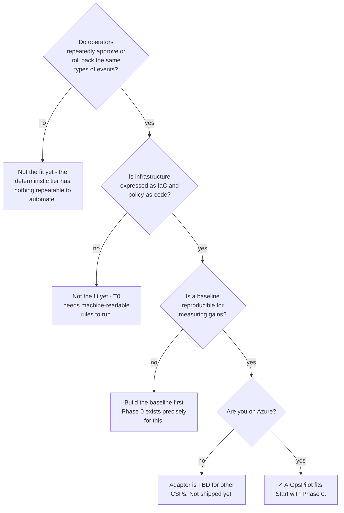

# Get Started with AIOpsPilot

AIOpsPilot is an autonomous cloud operations control plane. It resolves the
**repeatable majority** of operational events deterministically - with rules,
policies, and typed actions - and reserves LLM inference for the residual
**ambiguous minority** that survives the deterministic gate. Every autonomous
action is risk-classified, and anything above the safe threshold pauses for a
human-in-the-loop (HIL) approval.

The reference implementation targets **Azure**. The design keeps a cloud-neutral
seam so other CSPs are additive rather than requiring a core rewrite, but no
non-Azure adapter ships today.

## Three domains, one control plane

AIOpsPilot addresses three initial verticals under one event-driven core:

- **Change Safety** - rule-catalog-driven policy gates, remediation PRs,
  shadow-then-enforce rollout.
- **Resilience** - scheduled resilience drills, DB DR exercises, blast-radius
  bounded chaos experiments.
- **Cost Governance** - cost anomaly detection, right-sizing PRs, budget
  guardrails per resource group.

Each domain loads its own rules and actions but shares the same control loop,
observability, audit log, and risk gate.

## What "autonomous" means here

AIOpsPilot does not replace operators with an LLM. It classifies every event
into one of three tiers and routes accordingly:

- **T0 (deterministic, ~70-80% target coverage)** - policy-as-code decisions
  with a known correct outcome. No model call, no ambiguity.
- **T1 (lightweight, ~15-20%)** - pattern matching, embedding similarity, and
  small-model classifiers over the audit log's history. Cheap, fast, and
  auditable.
- **T2 (deep reasoning, ~5-10%)** - frontier models with mixed-model
  cross-check, deterministic verifier, and grounding checks. LLMs generate;
  execution eligibility is granted by verifier, not by the model itself.

The trust-router picks the lowest tier that can decide the event. The risk-gate
then decides whether the resulting action auto-executes or waits for approval.

## When AIOpsPilot fits

AIOpsPilot is a good fit when **all** of these are true:

- Operators already spend real time approving or rolling back repeatable
  cloud-configuration events (drift, cost regressions, policy violations).
- Your infrastructure is expressed as IaC and policy-as-code (or you are
  moving that way).
- You have - or can construct - a **baseline** to measure autonomy gains
  against. AIOpsPilot never claims a multiplier without a paired measurement.
- Your compliance regime tolerates auto-executed low-risk changes provided
  every action has a stop-condition, rollback path, blast-radius limit, and
  audit-log entry.

## When AIOpsPilot doesn't fit (yet)

- No IaC / no policy-as-code - the deterministic tier has nothing to run.
- One-off, non-repeatable incidents. AIOpsPilot's edge comes from resolving
  the repeatable majority; the residual novel minority is where humans stay
  in the loop.
- CSPs other than Azure. The abstractions are neutral by design, but the
  Azure adapter is the only one shipped.

## Next steps

- **Concepts** - read [Deterministic first](../concepts/deterministic-first/),
  [Risk tiers](../concepts/risk-tiers/), and
  [Shadow, then enforce](../concepts/shadow-then-enforce/) to understand
  the invariants any adoption depends on.
- **Guides** - task-oriented walkthroughs of the everyday operator flows:
  [Approve a change](../guides/approve-change/),
  [Read the audit log](../guides/read-audit-log/), and
  [Override a rule](../guides/override-a-rule/).
- **Reference** - the full engineering
  [roadmap](../reference/roadmap/) with per-phase deliverables, KPIs, the
  rule-catalog schema, and the deployment topology.
